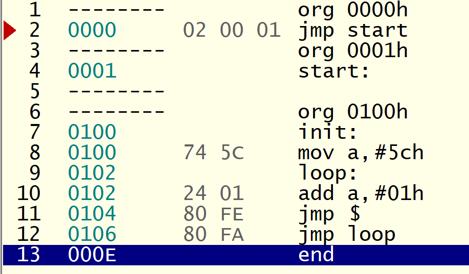

# Lesson 004: 汇编程序跳转与内存占用解析

## 1. 课程目标
- 理解跳转指令 `JMP` 产生的逻辑错误以及其背后原因。
- 掌握程序从不同地址开始时如何占用内存单元。
- 学会通过查看操作码（OPCODE）来分析每条指令占用的内存大小。

## 2. 逻辑错误与内存占用

### 2.1 **程序跳转中的逻辑错误**
- 在程序的开头，我们通过 `JMP start` 指令产生了一个逻辑错误。由于 `JMP start` 指令占用三个字节，当程序跳转到地址 0001H 时，仍在 `JMP` 指令的操作码范围内，导致了循环。
- 通过这个实验，学生可以清楚地看到跳转指令的操作码如何占用内存，并引发错误。

### 2.2 **后续程序的内存分配**
- 后续程序从地址 **0100H** 开始，使用了 `ORG 0100H` 指令来指定程序的起始地址。

```assembly
ORG 0100H
init:
    MOV A, #5Ch  ; 将 5Ch 装载到累加器 A 中
loop:
    ADD A, #01H  ; A = A + 01H
    JMP $        ; 无限循环，跳转到当前位置
    JMP loop     ; 跳转到 loop
END
```

### 2.3 **每条指令的内存占用**
通过查看操作码（OPCODE），我们可以看到每条指令占用了两个内存单元：


1. **`MOV A, #5Ch`**：操作码 `74 5C` 占用 **0100H** 和 **0101H** 两个内存地址。
2. **`ADD A, #01H`**：操作码 `24 01` 占用 **0102H** 和 **0103H** 两个内存地址。
3. **`JMP $`**：操作码 `80 FE` 占用 **0104H** 和 **0105H** 两个内存地址。
4. **`JMP loop`**：操作码 `80 FA` 占用 **0106H** 和 **0107H** 两个内存地址。

通过这些例子，学生可以看到每条指令的操作码占用的内存空间是不同的，而每条指令通常占用两个字节的内存。

---

## 3. 通过操作码查看内存占用

**操作码（OPCODE）解析**：
- 每条指令都有对应的操作码，这些操作码直接映射到内存地址。通过 Proteus 的仿真，学生可以看到：
  - **`MOV A, #5Ch`** 的操作码 `74 5C` 占用了 0100H 和 0101H。
  - **`ADD A, #01H`** 的操作码 `24 01` 占用了 0102H 和 0103H。
  - **`JMP $`** 和 **`JMP loop`** 的操作码分别是 `80 FE` 和 `80 FA`，各占用两个内存地址。

**重要概念**：
- **每条指令占用的内存字节数不同**，通过查看操作码可以帮助学生理解指令的实际内存消耗。
- **标签不占用内存**，如 `init:` 和 `loop:`，它们仅用作程序中的跳转点。

---

## 4. 总结

通过这堂课，学生将学到：
1. **跳转指令的逻辑错误**：通过 `JMP start` 指令的错误示例，理解跳转指令如何在内存中引发逻辑错误。
2. **每条指令的内存占用**：通过查看操作码，学生可以清楚地看到每条指令在内存中占据的空间。
3. **后续程序从地址 0100H 开始**：程序在 0100H 处开始运行，学生可以看到每条指令占用两个内存单元，并理解标签不占内存的概念。
