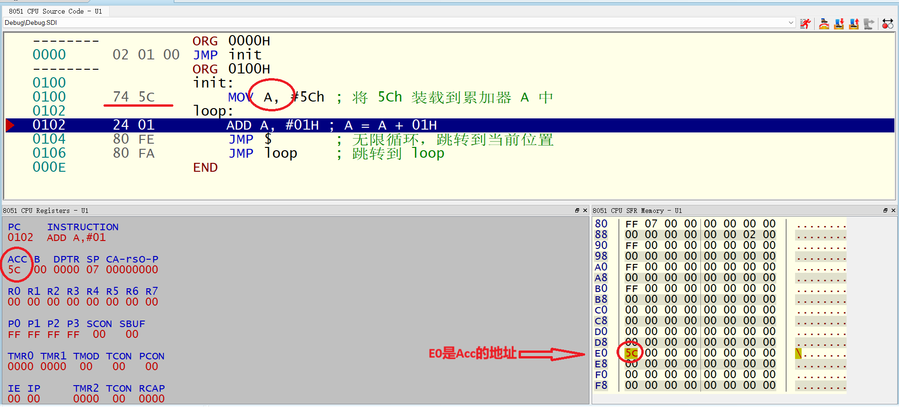

# Lesson 006: 累加器 A 与 0E0H 的操作观察

## 1. 课程目标
- 通过对比累加器 A 和 0E0H 地址的两种操作方式，理解它们的区别。
- 掌握如何通过操作码（OPCODE）观察不同代码的执行差异。
- 学会灵活使用不同指令来实现相同功能，并理解背后的实现机制。

---

## 2. 课程内容

### 2.1 **累加器 A 和 0E0H 的地址关系**

在 8051 微控制器中，**累加器 A（ACC）** 对应的内存地址为 **0E0H**。也就是说，操作累加器 A 实际上是对 0E0H 地址进行操作。这为我们提供了两种不同的操作方式：

1. **直接操作累加器 A**。
2. **通过内存地址 0E0H 操作累加器**。

### 2.2 **代码对比与操作**

以下是两段实现相同功能的代码：

#### 原始代码：
```assembly
ORG 0000H
JMP init
ORG 0100H
init:
    MOV A, #5Ch  ; 将 5Ch 装载到累加器 A 中
loop:
    ADD A, #01H  ; A = A + 01H
    JMP $        ; 无限循环，跳转到当前位置
    JMP loop     ; 跳转到 loop
END
```

#### 更新后的代码：
```assembly
ORG 0000H
JMP init
ORG 0100H
init:
    MOV 0E0h, #5Ch  ; 将 5Ch 装载到 0E0H 地址（累加器 A）
loop:
    ADD A, #01H     ; A = A + 01H
    JMP $           ; 无限循环，跳转到当前位置
    JMP loop        ; 跳转到 loop
END
```


### 2.3 **通过操作码的差异观察两段代码的不同**

- **原始代码**中，`MOV A, #5Ch` 的操作码为 **74 5C**。
- **更新后的代码**中，`MOV 0E0h, #5Ch` 的操作码为 **75 E0 5C**。

#### 操作码分析：
1. **`MOV A, #5Ch`（74 5C）**：
   - 操作码 **74** 表示将立即数加载到累加器 A 中。
   - 累加器 A 是 8051 中专用的寄存器，直接使用 A 进行操作会生成较短的操作码（74 + 立即数）。
   
2. **`MOV 0E0h, #5Ch`（75 E0 5C）**：
   - 操作码 **75** 是通用的 `MOV` 指令，用于将立即数加载到指定的内存地址。
   - **E0** 是累加器 A 的内存地址，表示通过内存地址间接操作累加器。
   - 这段代码生成的操作码更长，涉及通用的存储操作。

通过这些操作码的差异，学生可以直观地看到两段代码虽然功能相同，但在实现方式上有所不同。

---

## 3. 通过观察发现问题

### 3.1 **直接操作与内存地址操作的区别**
- 通过观察，我们可以发现 **累加器 A** 和 **0E0H** 实际上是同一个地址。
- 但是，当我们使用 **MOV A, #5Ch** 时，操作码更加简洁（74 5C），因为累加器 A 是 8051 中的一个专用寄存器。
- 使用 **MOV 0E0h, #5Ch** 则是通过内存地址来操作累加器 A，操作码变得更长（75 E0 5C），因为这种方式是通过内存地址来间接操作。

### 3.2 **执行效果的差异**
- 虽然两段代码实现相同的功能，但执行效率和操作码的复杂度不同：
  - **直接操作累加器 A**（74 5C）执行得更快，生成的操作码更短。
  - **通过 0E0H 操作累加器 A**（75 E0 5C）生成的操作码更长，但展示了 8051 中寄存器与内存地址的关系。

---

## 4. 总结

累加器 A 与内存地址 0E0H 的关系：两者是同一个物理地址，可以通过直接操作 A 或使用内存地址来实现相同的功能。
操作码的不同：通过对比 MOV A, #5Ch 和 MOV 0E0H, #5Ch 的操作码，学生可以了解汇编语言中操作码的差异及其对程序执行的影响。
观察与实验：通过观察两段代码的操作码，学生可以更深入理解指令执行背后的机制，并在不同应用场景下选择适合的指令。